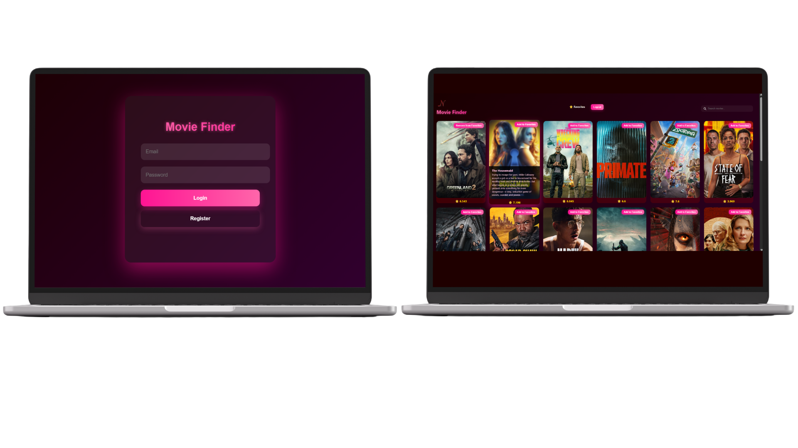

Aşağıya direkt kopyalayıp kullanabileceğin, profesyonel ve tamamen İngilizce README.md dosyasını bırakıyorum:

## 🎬 PopularMoviesAPI

# Created with

## 🎥 Responsive Movie Discovery & User Management Application

PopularMoviesAPI is a fully responsive web application that includes a user registration and login system, displays popular movies, provides a detailed movie page, and allows users to add movies to their favorites.

The application dynamically fetches real-time data from an external movie API to generate interactive content.

---

## 🌐 Live Demo

👉 **[Click here to see the live demo](https://lightlymoon.github.io/PopularMoviesAPI/)**

---

# 📱 User Interface Preview

## Desktop Views 

---

## 📌 About The Project

This project was developed using **HTML**, **CSS**, and **JavaScript**.  
After registering, users can log in and access movie content.

The project covers the following concepts:

- 👤 User registration and login system  
- 🌍 REST API integration  
- ⚡ Asynchronous JavaScript (async / await)  
- 🧩 Dynamic DOM manipulation  
- 📱 Responsive design  
- 💾 Data storage with LocalStorage  
- 🔄 Movie detail page routing  

---

# 🚀 Features

## 👤 User Registration & Login System

- User registration (Register)
- Login with registered account
- Restricted access to movie pages without login
- User data stored in LocalStorage

---

## 🎬 Popular Movies Listing

- Fetching popular movies from API
- Displaying movie posters, titles, and ratings
- Dynamic card-based layout

---

## 🔍 Movie Search Feature

- Search movies by title
- Real-time API results
- Dynamic content update without page reload

---

## 📄 Movie Detail Page

- Dedicated detail page for selected movie
- Movie overview/description
- Rating information
- API request using movie ID

---

## ⭐ Add to Favorites System

- Add movies to favorites
- Store favorites in LocalStorage
- Favorites persist after page refresh
- User-specific favorite list

---

# 💻 Technical Details

- Fetch API usage
- Async / Await structure
- Dynamic HTML generation with template literals
- Event listener management
- LocalStorage for user and favorites data
- Conditional routing (login protection)
- Modular and readable code structure

---

## ⭐ Support ⭐ 
⋆⭒˚.⋆ If you like this project, do not forget to give a star ⋆⭒˚.⋆

  ⚠️ This README is uniquely designed by <strong>@lightlymoon.</strong>

